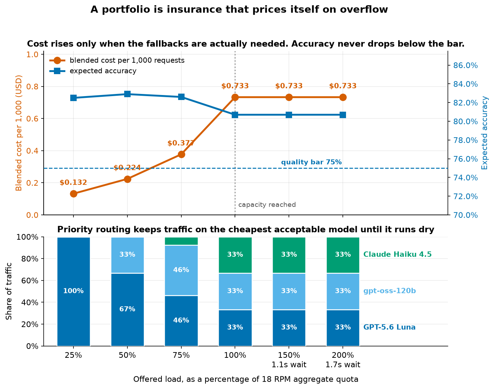

# Capacity Management for Large Generative AI Workloads

![Two-panel summary of the module's measured result. Left panel: the routing priority list drawn as a supply curve, with cumulative quality-weighted capacity in requests per minute on the x-axis and cost per 1,000 classifications on the y-axis. Three admitted models form a rising staircase, each step as wide as its quota and as tall as its cost: GPT-5.6 Luna, 400 RPM at $0.132 per 1,000, 82.5% accuracy; gpt-oss-120b, 400 RPM at $0.408, 83.8%; Claude Haiku 4.5, 100 RPM at $1.660, 76.0%. A heavy black line overlays the staircase showing the blended cost actually paid, flat at $0.132 while the first model has capacity and rising to $0.424 per 1,000 at the full 900 RPM. A dashed line marks the $2.00 per 1,000 cost ceiling. Past the admitted region, a ghost step running off the top of the chart shows Claude Sonnet 5 rejected at $7.008 per 1,000, 53 times GPT-5.6 Luna's cost, despite clearing the quality bar at 78.6%. Right panel: at 900 requests per minute of demand, a single first-choice model serves 400 RPM at $0.132 per 1,000 and leaves 500 RPM throttled or queued, while the three-model priority list serves all 900 RPM at a blended $0.424 per 1,000 with 82.4% expected accuracy.](images/fig6-capacity-supply-curve-hero.png)

## Overview

Most model evaluation asks *"which model is best?"* and ships the winner. That works until your
workload outgrows what a single model will serve you. It also locks you out of taking advantage of increased quality and cost savings when new models are launched. 

At high volume the binding constraint stops being quality and becomes **quota**. If you need
1,000 requests per minute and your best model gives you 400, no amount of prompt engineering on
that one model fixes the problem. You need to evaluate several models, to optimize your workload for each model, and to prove which ones are
good enough to trust with production traffic.

That turns model selection from a ranking problem into a **portfolio** problem, and it gives
evaluation a new job: deciding who is allowed in the portfolio.



## The Core Metric

> **Quality-weighted capacity** = the sum of the quota of every model that passes your quality bar

One model at 82% accuracy and 400 RPM buys you 400 RPM. Four models that all clear your accuracy bar buy
you four models' worth. This makes **evaluation and prompt optimization a capacity lever, not just a quality
lever.** Every model you can lift over the quality bar adds its quota to your ceiling.

In this module's example run, one model gives you 400 RPM while every model that clears the bar
gives you 1,000 RPM — no quota increase requested. Prompt optimization is what makes the difference
between two models clearing the bar and four.

We also put a price cap on adding models to our portfolio.  In our example, we add a $2.00 per 1,000 token cost ceiling.  This excludes one model so the routing table settles at **900 RPM** across three models. That is what the figure above
prices, slice by slice.

## What You'll Learn

| Section | Topic |
|---|---|
| 1-2 | Token bucket rate limiting: how Bedrock throttling actually works, and why "6 per minute" does not mean "wait for the top of the minute" |
| 3 | The naive baseline: what a single-model client with no retry handling actually loses |
| 4 | Measuring accuracy, cost per 1,000, and latency across a five-model portfolio |
| 5 | How much your evaluator affects your results — a 30+ point accuracy swing with no change to model or prompt |
| 6 | Advanced Prompt Optimization: one prompt, five models, one job, with a custom Lambda evaluator |
| 7 | Re-measuring on held-out data, and computing quality-weighted capacity |
| 8 | Capacity-aware routing with a priority list, a quality bar, and a cost ceiling |
| 9 | The before/after comparison: same workload, same models, same quota — just an optimized prompt per model and a router that knows where the capacity is |

## The Workload

**BANKING77 intent classification** — 13,083 real online-banking customer service messages, each
labelled with one of 77 fine-grained intents. Support triage stands in well for the workloads
this module is about: very high volume, short inputs, short outputs, objective ground truth, and
77 confusable classes that genuinely separate strong models from weak ones.

A sampled subset is vendored under `data/`, so the notebook runs with no download.

> BANKING77 is from Casanueva et al., *Efficient Intent Detection with Dual Sentence Encoders*,
> published at [PolyAI-LDN/task-specific-datasets](https://github.com/PolyAI-LDN/task-specific-datasets)
> and licensed CC-BY-4.0.

## Models Used

Five text models across three providers. Portfolios built from one provider tend to share quota
pools and correlated outages.

| Model | ID | $/1M in | $/1M out |
|---|---|---|---|
| Amazon Nova 2 Lite | `us.amazon.nova-2-lite-v1:0` | 0.33 | 2.75 |
| Anthropic Claude Haiku 4.5 | `us.anthropic.claude-haiku-4-5-20251001-v1:0` | 1.00 | 5.00 |
| Anthropic Claude Sonnet 5 | `us.anthropic.claude-sonnet-5` | 3.00 | 15.00 |
| OpenAI gpt-oss-120b | `openai.gpt-oss-120b-1:0` | 0.15 | 0.60 |
| OpenAI GPT-5.6 Luna | `us.openai.gpt-5.6-luna` | 0.20 | 1.20 |

## File Structure

```
Capacity Management/
├── README.md                                  # This file
├── 01 Capacity Management Evaluation.ipynb    # The module
├── requirements.txt
├── capacity.py                                # TokenBucket, QuotaSimulator, CapacityRouter
├── model_config.py                            # model IDs, pricing, quota tables
├── banking77.py                               # dataset, prompts, grader, metrics
├── data/
│   ├── banking77_eval.jsonl                   # 154 held-out items, 2 per class (test split)
│   ├── banking77_optimizer_samples.jsonl      # 77 items, 1 per class (train split)
│   ├── banking77_labels.json                  # the 77 canonical labels
│   ├── advpo_input.jsonl                      # the AdvPO job input, as submitted
│   └── advpo_results.jsonl                    # real AdvPO job output, committed
├── images/
│   ├── fig2-routing-timeline.png              # same burst, one model vs a portfolio
│   ├── fig3-load-curve.png                    # blended cost and accuracy vs load
│   ├── fig4-token-bucket-mechanics.png        # token bucket draining and refilling
│   ├── fig5-quality-weighted-capacity-hero.png # one model vs every model that qualifies
│   └── fig6-capacity-supply-curve-hero.png    # the priority list priced (README hero)
└── scripts/
    ├── lambda_evaluator.py                    # the custom AdvPO scoring function
    ├── run_advpo_job.py                       # creates infra, submits the job, fetches results
    ├── make_fig5_figure.py                    # regenerates fig5 from model_config
    └── make_hero_figure.py                    # regenerates fig6 from model_config
```

## About the Simulated Quotas

Real Bedrock quotas are high enough that reaching them in a workshop would take thousands of
requests. The module imposes much smaller **artificial** per-model limits so
throttling is observable in seconds. The mechanics are identical; only the numbers are smaller.
Tune `DEMO_QUOTAS` in `model_config.py` to trade runtime against realism.

The *shape* of the example limits is deliberate, though. On Bedrock the smaller and cheaper models
generally carry the higher default request quotas, while frontier models carry the tighter ones, so
`PRODUCTION_QUOTAS_EXAMPLE` gives the two cheapest models four times the ceiling of the rest. That
matters for the result: prompt optimization tends to rescue the models that were failing the bar,
and those are usually the ones with the most quota to contribute. You can check the current
defaults for your own account with:

```bash
aws service-quotas list-aws-default-service-quotas --service-code bedrock \
  --region us-east-1 --query \
  'Quotas[?contains(QuotaName, `requests per minute`)].[QuotaName,Value]'
```

A local limiter is also less artificial than it first looks. In production it is common to put a
per-workload or per-tenant limiter *in front of* Bedrock so one workload cannot drain the
account's quota. In that architecture a local limiter that knows its own budget is exactly what
you run.

The module models **requests per minute only**. Bedrock also enforces tokens per minute, and RPM
is not enforced for every model — several models are governed by token quotas alone. Whichever
limit binds first, the routing lesson is the same, because a token bucket behaves identically
either way. In production, check which limits actually apply to your models and monitor both.

## Getting Started

1. Install dependencies:
   ```bash
   pip install -r requirements.txt
   ```
2. Configure AWS credentials for a region with all five models enabled (the module defaults to
   `us-east-1`). Enable model access in the Bedrock console under **Model access**.
3. Open `01 Capacity Management Evaluation.ipynb` and run it top to bottom.

**Estimated time**: 45-60 minutes.

**Estimated cost**: under $3 in on-demand inference.

## Prerequisites

- AWS account with Amazon Bedrock access and all five models enabled
- Python 3.10+
- Completion of the [Foundational Evaluations](../../Foundational%20Evaluations/)

## Re-running the Prompt Optimization Job

An AdvPO job is asynchronous and takes 15 minutes to several hours, so it does not fit in a
notebook cell. To save time while learning, the job was run for real and the results are committed to
`data/advpo_results.jsonl`; the notebook shows the full setup and loads those results.

To run the AdvPO job yourself, `scripts/run_advpo_job.py` handles the whole lifecycle:

```bash
python scripts/run_advpo_job.py build      # build the input JSONL, no AWS calls
python scripts/run_advpo_job.py setup      # S3 bucket, IAM role, Lambda evaluator
python scripts/run_advpo_job.py submit     # upload and start the job
python scripts/run_advpo_job.py wait       # poll to completion
python scripts/run_advpo_job.py fetch      # download results into data/
python scripts/run_advpo_job.py all        # all of the above
python scripts/run_advpo_job.py teardown   # remove the Lambda and IAM role
```

This needs **boto3 >= 1.43** (when `create_advanced_prompt_optimization_job` landed) and
permission to manage S3, IAM, Lambda, and Bedrock. It creates an S3 bucket, an IAM role, and a
Lambda function in your account.

## Key Takeaways

- **Capacity is an evaluation problem.** "Which model is best?" is the wrong question. The useful
  one is "which set of models is good enough, and how can I optimize for all of them?" Evaluation
  decides membership, so your evaluation harness is a capacity planning tool.
- **Measure your own workload.** On this task the results contradicted what a general capability
  ranking would predict: the most expensive model was not the most accurate, the cheapest model
  per token was not the cheapest per request (reasoning tokens do not show up in a price list),
  and the strongest model was also the fastest and the cheapest.
- **Evaluating your evaluator is critical.** Changing only the rule for extracting a label from a
  response moved one model's measured accuracy by more than 30 points.
- **Optimize per model, and verify on held-out data.** There is no single best prompt for a
  portfolio. Re-measure afterwards on data the optimizer never saw, and adopt each rewrite only
  where it actually won.
- **Admission needs a cost ceiling, not just a quality bar.** One model cleared the accuracy bar
  while costing far more per request than the cheapest passing model.
- **Stop picking a model. Start maintaining a list.** A model priority list is not a decision, it's
  a living artifact with a shelf life. Models get deprecated, new ones launch, prices change, and
  workloads drift. Re-run the notebook on a schedule — quarterly at minimum, plus on any
  deprecation notice or interesting launch — and let the routing table be whatever the
  measurement says it is this time.
